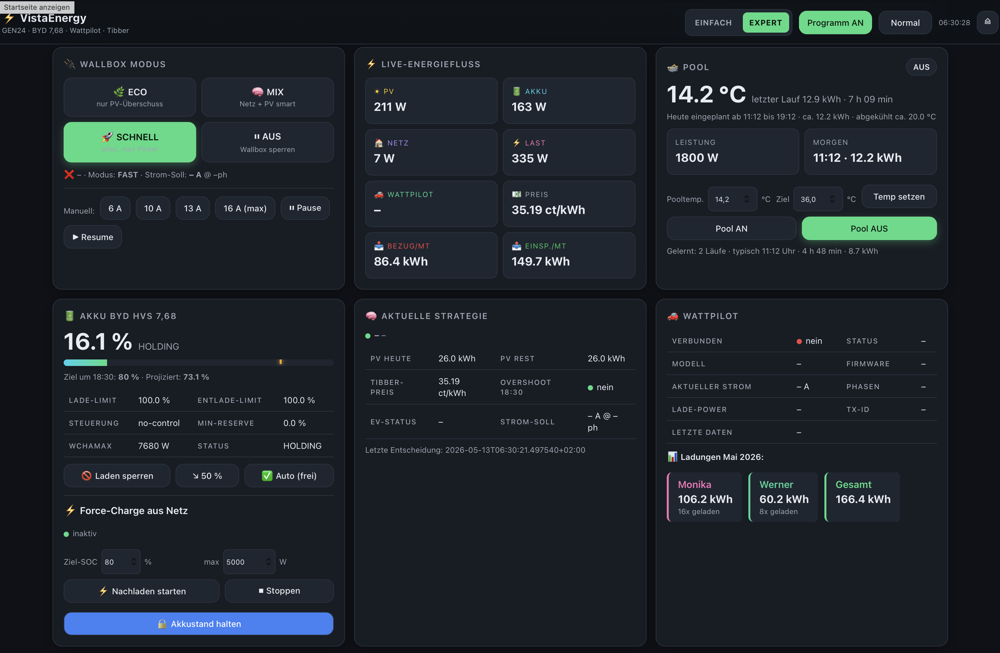
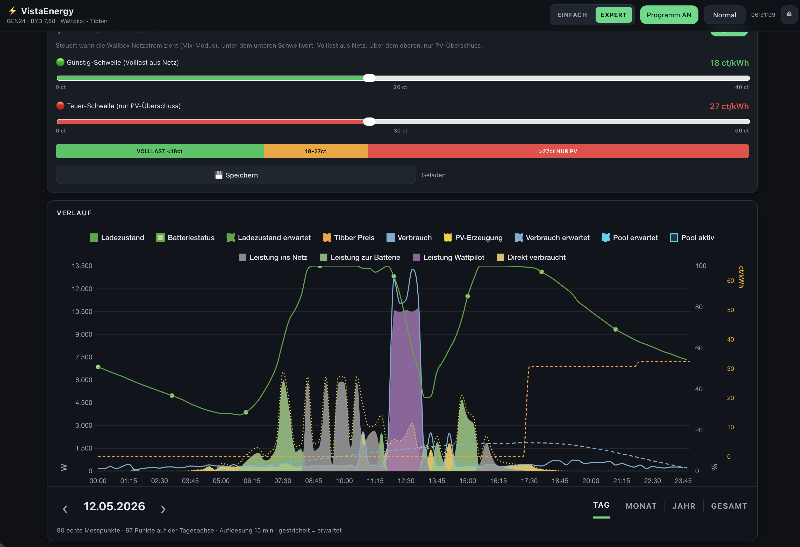
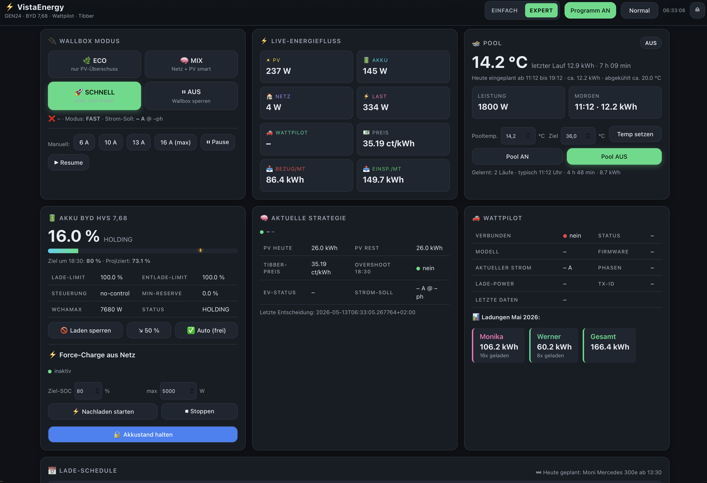

# Vista-Energy

**Intelligent PV optimization with dynamic tariff control, battery management, and EV charger automation.**

Vista-Energy is a fully automated energy management system for photovoltaic systems with battery storage. It runs locally on a mini PC and maximizes self-consumption through intelligent control of battery, EV charger, and consumers — based on real-time electricity prices, PV forecasts, and learned consumption profiles.

> **Website:** [vista-pv.com](https://vista-pv.com) | **Admin Panel:** [admin.vista-pv.com](https://admin.vista-pv.com)

---

## Screenshots

### Expert Dashboard — Overview

*Live energy flow, wallbox control, battery status, pool heating, optimization strategy, and per-RFID charging logs.*

### Energy History — Daily View

*24h chart with PV generation, battery charge/discharge, consumption, grid feed-in, and Tibber electricity prices. Configurable price thresholds for cheap/expensive charging.*

### Full Dashboard — with Charge Schedule

*Complete view with wallbox modes (ECO/MIX/FAST), live energy flow, battery control, force-charge, charge scheduling, and RFID billing.*

---

## Features

### Fully Automatic Optimization
- **Learning-profile based control** — Learns daily consumption patterns and automatically adjusts battery strategy
- **PV forecast** — Daily and multi-day PV generation forecast based on weather data
- **Dynamic tariff optimization** — Uses Tibber hourly prices for optimal charge/discharge timing
- **Smart daily plan** — Shows cheapest/most expensive hours, battery recommendations, and scheduled charges

### Battery Management
- **SOC target control** — Automatic battery target based on PV forecast (e.g., "Target 80% by 18:30")
- **Force-charge from grid** — Use cheap night electricity to pre-charge battery
- **Charge/discharge limits** — Fine-grained battery power control via Modbus
- **Hold battery level** — Freeze battery at current SOC

### EV Charger Control
- **ECO mode** — Charge only with PV surplus (0 ct electricity cost)
- **MIX mode** — Smart mix of PV and grid based on electricity price
- **FAST mode** — Maximum charge power (full grid load)
- **Charge schedule** — Time-based charging per vehicle (e.g., "Tue-Fri 13:30-17:00, 16A x 3ph")
- **RFID billing** — Track charges per RFID chip/driver with CSV export
- **Phase switching** — Automatic 1p/3p switching based on available power

### Pool / Heat Pump Control
- **Temperature control** — Monitor pool temperature and set target
- **PV-controlled heating** — Heat pool only with PV surplus
- **Learning profile** — Learned run times and energy consumption per pool cycle

### Energy Monitoring
- **Live energy flow** — Real-time display of PV, battery, grid, load, wallbox
- **24h history chart** — PV generation, consumption, battery, grid with Tibber price overlay
- **Monthly/yearly statistics** — Grid import, feed-in, self-consumption ratio
- **Price thresholds** — Configurable cheap/expensive thresholds for automatic actions

### Two Dashboard Modes
- **SIMPLE** — Clean dashboard for everyday use
- **EXPERT** — Full access to all parameters, charts, and controls

---

## Supported Hardware

### Inverters
| Manufacturer | Models | Protocol |
|---|---|---|
| **Fronius** | Symo GEN24, GEN24 Plus, Primo GEN24 | Solar API + Modbus TCP |
| **SMA** | Sunny Tripower X, Sunny Boy, STP Smart Energy | Modbus TCP (SunSpec) |
| **Huawei** | SUN2000-3KTL to SUN2000-12KTL | Modbus TCP (SDongle) |

### Battery Storage
| Manufacturer | Models | Protocol |
|---|---|---|
| **BYD** | Battery-Box Premium HVS 5.1-12.8, HVM 8.3-22.1 | Modbus TCP (BMS) |
| **Tesla** | Powerwall 2, Powerwall+, Powerwall 3 | HTTPS REST API (Gateway) |
| **sonnen** | sonnenBatterie eco/pro 8, 10, 10 performance | HTTP REST API |
| **LG** | RESU 6.5, 10, 10H, 12, 16H Prime | Modbus TCP |
| **Huawei** | LUNA2000-5/10/15-S0 | Modbus TCP (via SUN2000) |
| **E3/DC** | S10 E, S10 E PRO, S10 X, S10 Mini | Modbus TCP (Simple Mode) |

### EV Chargers (Wallboxes)
| Manufacturer | Models | Protocol |
|---|---|---|
| **Fronius** | WattPilot Go/Home 11/22 | OCPP 1.6 WebSocket |
| **go-e** | Charger Gemini, Gemini flex, HOME+ | HTTP API v2 (local) |
| **OpenWB** | openWB 1.x, openWB series 2 | MQTT + HTTP Fallback |
| **KEBA** | KeContact P30 c-/x-series | UDP Port 7090 |

### Electricity Tariffs
| Provider | Type |
|---|---|
| **Tibber** | Dynamic hourly pricing (API) |
| **Fixed price** | Standard utility / fixed kWh price |
| **Dual rate** | Peak/off-peak (day/night) |

---

## Architecture

```
Vista-Energy (Mini PC, local)
+-- Flask Web Dashboard (Port 8080)
|   +-- Simple mode (daily plan, automation)
|   +-- Expert mode (full control)
+-- Optimizer Engine
|   +-- PV forecast (forecast.solar + weather data)
|   +-- Tibber integration (hourly prices)
|   +-- Learning profile (consumption patterns)
|   +-- Decision logic (charge/discharge/hold)
+-- Hardware Plugins (plugin system)
|   +-- Inverter (Fronius / SMA / Huawei)
|   +-- Battery (BYD / Tesla / sonnen / LG / LUNA / E3DC)
|   +-- Wallbox (WattPilot / go-e / OpenWB / KEBA)
|   +-- Tariff (Tibber / Fixed / Dual rate)
+-- Services
    +-- OCPP Server (wallbox communication)
    +-- Update Service (OTA updates)
    +-- License Service
```

### Cloud Infrastructure (Cloudflare)
```
vista-pv.com            -> Cloudflare Pages (website + PayPal subscriptions)
license.vista-pv.com    -> Cloudflare Worker (license API)
admin.vista-pv.com      -> Cloudflare Worker (admin dashboard)
D1 Database              -> License management
R2 Bucket                -> Update archive (OTA)
```

---

## Installation

### Requirements
- Mini PC / Raspberry Pi 4+ with Debian/Ubuntu
- Python 3.10+
- Network access to inverter (Modbus TCP / HTTP)

### Setup

```bash
# Clone repository
git clone https://github.com/Masterzzz2/vista-energy.git
cd vista-energy

# Install dependencies
pip install -r requirements.txt

# Create configuration
cp config.yaml.example config.yaml
# Edit config.yaml (inverter IP, tariff, etc.)

# Start
python app.py
```

The dashboard is then available at `http://<mini-pc-ip>:8080`.

### Configuration

The `config.yaml` controls all hardware plugins:

```yaml
inverter:
  type: fronius_gen24        # or: sma_tripower, huawei_sun2000
  ip: 192.168.1.80

battery:
  type: byd_hvs              # or: tesla_powerwall, sonnen_batterie, lg_resu, huawei_luna2000, e3dc
  capacity_kwh: 10.24

wallbox:
  type: fronius_wattpilot    # or: goe_charger, openwb, keba_kecontact
  ocpp_ws: ws://127.0.0.1:8889

tariff:
  type: tibber               # or: fixed_price, dual_rate
  api_key: YOUR_TIBBER_TOKEN
```

See [config.yaml.example](config.yaml.example) for all options and comments.

---

## Plugin System

New hardware is added as a plugin — no changes to the core system required:

```
services/
+-- inverters/
|   +-- base.py              # Abstract interface
|   +-- fronius_gen24.py     # Fronius GEN24
|   +-- sma_tripower.py      # SMA Sunny Tripower
|   +-- huawei_sun2000.py    # Huawei SUN2000
+-- wallboxes/
|   +-- base.py              # Abstract interface
|   +-- fronius_wattpilot.py # Fronius WattPilot
|   +-- goe_charger.py       # go-e Charger
|   +-- openwb.py            # OpenWB
|   +-- keba_kecontact.py    # KEBA KeContact
+-- batteries/
|   +-- base.py              # Abstract interface
|   +-- byd_hvs.py           # BYD HVS/HVM
|   +-- tesla_powerwall.py   # Tesla Powerwall
|   +-- sonnen_batterie.py   # sonnenBatterie
|   +-- lg_resu.py           # LG RESU
|   +-- huawei_luna2000.py   # Huawei LUNA2000
|   +-- e3dc.py              # E3/DC Hauskraftwerk
+-- tariffs/
    +-- tibber.py            # Tibber (dynamic)
    +-- fixed_price.py       # Fixed price
    +-- dual_rate.py         # Peak/off-peak dual rate
```

### Creating a Custom Plugin

1. Create new file in `services/inverters/` (or wallboxes/batteries)
2. Derive class from `InverterBase` (or `WallboxBase`/`BatteryBase`)
3. Implement `get_power_flow()`, `get_info()`, `plugin_id()`, `plugin_name()`
4. Register in `plugin_registry.py`
5. Configure in `config.yaml` — done!

---

## Licensing

Vista-Energy is a commercial product with a subscription model:

| Plan | Price | Included |
|---|---|---|
| **Monthly** | 4.99 EUR/month | All features, updates, support |
| **Yearly** | 39.99 EUR/year | All features, updates, support (33% discount) |

Licenses are purchased via [vista-pv.com](https://vista-pv.com) (PayPal subscription).

---

## Tech Stack

- **Backend:** Python 3.10+, Flask, APScheduler
- **Frontend:** HTML5/CSS3/JavaScript (single-page dashboard)
- **Database:** SQLAlchemy (SQLite)
- **Hardware:** Modbus TCP (pymodbus), MQTT (paho-mqtt), HTTP/REST, OCPP 1.6, UDP
- **Cloud:** Cloudflare Workers/Pages/D1/R2
- **Payments:** PayPal Subscriptions API
- **Updates:** OTA via Cloudflare R2

---

## Contact

- **Website:** [vista-pv.com](https://vista-pv.com)
- **Email:** info@vista-pv.com
- **GitHub:** [Masterzzz2/vista-energy](https://github.com/Masterzzz2/vista-energy)

---
---

# Vista-Energy (Deutsch)

**Intelligente PV-Optimierung mit dynamischer Tarifsteuerung, Batteriemanagement und Wallbox-Steuerung.**

Vista-Energy ist ein vollautomatisches Energiemanagement-System fuer Photovoltaik-Anlagen mit Batteriespeicher. Es laeuft lokal auf einem Mini-PC und optimiert den Eigenverbrauch durch intelligente Steuerung von Batterie, Wallbox und Verbrauchern — basierend auf Echtzeit-Strompreisen, PV-Prognosen und gelernten Verbrauchsprofilen.

> **Website:** [vista-pv.com](https://vista-pv.com) | **Lizenz-Verwaltung:** [admin.vista-pv.com](https://admin.vista-pv.com)

---

## Screenshots

### Expert-Dashboard — Uebersicht

*Live-Energiefluss, Wallbox-Steuerung, Akku-Status, Pool-Steuerung, Strategie-Anzeige und WattPilot-Ladungen pro RFID-Chip.*

### Energie-Verlauf — Tagesansicht

*24h-Verlauf mit PV-Erzeugung, Batterieladung, Verbrauch, Netzeinspeisung und Tibber-Strompreisen. Schwellwerte fuer guenstiges/teures Laden konfigurierbar.*

### Dashboard Komplett — mit Lade-Schedule

*Komplettansicht mit Wallbox-Modi (ECO/MIX/SCHNELL), Live-Energiefluss, Akku-Steuerung, Force-Charge, Lade-Schedule und RFID-Abrechnungen.*

---

## Features

### Vollautomatische Optimierung
- **Lernprofil-basierte Steuerung** — Lernt taegliche Verbrauchsmuster und passt die Batterie-Strategie automatisch an
- **PV-Prognose** — Tages- und Mehrtages-Vorhersage der PV-Erzeugung basierend auf Wetterdaten
- **Dynamische Tarifoptimierung** — Nutzt Tibber-Stundenpreise fuer optimales Laden/Entladen
- **Intelligenter Tagesplan** — Zeigt guenstigste/teuerste Stunden, Akku-Empfehlungen und geplante Ladungen

### Batterie-Management
- **SOC-Zielsteuerung** — Automatisches Batterie-Ziel basierend auf PV-Prognose (z.B. "Ziel 80% um 18:30")
- **Force-Charge aus Netz** — Guenstigen Nachtstrom nutzen um Batterie vorzuladen
- **Lade-/Entlade-Limits** — Feinsteuerung der Batterie-Leistung per Modbus
- **Akkustand halten** — Batterie auf aktuellem Level einfrieren

### Wallbox-Steuerung
- **ECO-Modus** — Laden nur mit PV-Ueberschuss (0 ct Stromkosten)
- **MIX-Modus** — Intelligenter Mix aus PV und Netz basierend auf Strompreis
- **SCHNELL-Modus** — Maximale Ladeleistung (Vollast aus Netz)
- **Lade-Schedule** — Zeitgesteuerte Ladungen pro Fahrzeug (z.B. "Di-Fr 13:30-17:00, 16A x 3ph")
- **RFID-Abrechnung** — Ladungen pro RFID-Chip/Fahrer tracken und als CSV exportieren
- **Phasenumschaltung** — Automatische 1p/3p-Umschaltung je nach verfuegbarer Leistung

### Pool-/Waermepumpen-Steuerung
- **Temperatur-Steuerung** — Pool-Temperatur ueberwachen und Zieltemperatur setzen
- **PV-gesteuertes Heizen** — Pool nur bei PV-Ueberschuss heizen
- **Lernprofil** — Gelernte Laufzeiten und Energieverbrauch pro Pool-Lauf

### Energie-Monitoring
- **Live-Energiefluss** — Echtzeit-Anzeige von PV, Akku, Netz, Last, Wallbox
- **24h-Verlaufschart** — PV-Erzeugung, Verbrauch, Batterie, Netz mit Tibber-Preisoverlay
- **Monats-/Jahresstatistiken** — Bezug, Einspeisung, Eigenverbrauchsquote
- **Preis-Schwellwerte** — Konfigurierbare Guenstig-/Teuer-Schwellen fuer automatische Aktionen

### Zwei Dashboard-Modi
- **EINFACH** — Uebersichtliches Dashboard fuer den Alltag
- **EXPERT** — Voller Zugriff auf alle Parameter, Charts und Steuerungen

---

## Unterstuetzte Hardware

### Wechselrichter
| Hersteller | Modelle | Protokoll |
|---|---|---|
| **Fronius** | Symo GEN24, GEN24 Plus, Primo GEN24 | Solar API + Modbus TCP |
| **SMA** | Sunny Tripower X, Sunny Boy, STP Smart Energy | Modbus TCP (SunSpec) |
| **Huawei** | SUN2000-3KTL bis SUN2000-12KTL | Modbus TCP (SDongle) |

### Batteriespeicher
| Hersteller | Modelle | Protokoll |
|---|---|---|
| **BYD** | Battery-Box Premium HVS 5.1–12.8, HVM 8.3–22.1 | Modbus TCP (BMS) |
| **Tesla** | Powerwall 2, Powerwall+, Powerwall 3 | HTTPS REST-API (Gateway) |
| **sonnen** | sonnenBatterie eco/pro 8, 10, 10 performance | HTTP REST-API |
| **LG** | RESU 6.5, 10, 10H, 12, 16H Prime | Modbus TCP |
| **Huawei** | LUNA2000-5/10/15-S0 | Modbus TCP (via SUN2000) |
| **E3/DC** | S10 E, S10 E PRO, S10 X, S10 Mini | Modbus TCP (Simple Mode) |

### Wallboxen
| Hersteller | Modelle | Protokoll |
|---|---|---|
| **Fronius** | WattPilot Go/Home 11/22 | OCPP 1.6 WebSocket |
| **go-e** | Charger Gemini, Gemini flex, HOME+ | HTTP API v2 (lokal) |
| **OpenWB** | openWB 1.x, openWB series 2 | MQTT + HTTP Fallback |
| **KEBA** | KeContact P30 c-/x-series | UDP Port 7090 |

### Stromtarife
| Anbieter | Typ |
|---|---|
| **Tibber** | Dynamischer Stundenpreis (API) |
| **Festpreis** | Grundversorger / fester kWh-Preis |
| **Doppeltarif** | HT/NT (Tag/Nacht) |

---

## Architektur

```
Vista-Energy (Mini-PC, lokal)
+-- Flask Web-Dashboard (Port 8080)
|   +-- Einfach-Modus (Tagesplan, Automatik)
|   +-- Expert-Modus (volle Kontrolle)
+-- Optimizer Engine
|   +-- PV-Prognose (forecast.solar + Wetterdaten)
|   +-- Tibber-Integration (Stundenpreise)
|   +-- Lernprofil (Verbrauchsmuster)
|   +-- Entscheidungslogik (Laden/Entladen/Halten)
+-- Hardware-Plugins (Plugin-System)
|   +-- Inverter (Fronius / SMA / Huawei)
|   +-- Batterie (BYD / Tesla / sonnen / LG / LUNA / E3DC)
|   +-- Wallbox (WattPilot / go-e / OpenWB / KEBA)
|   +-- Tarif (Tibber / Festpreis / Doppeltarif)
+-- Services
    +-- OCPP-Server (Wallbox-Kommunikation)
    +-- Update-Service (OTA-Updates)
    +-- Lizenz-Service
```

### Cloud-Infrastruktur (Cloudflare)
```
vista-pv.com            -> Cloudflare Pages (Website + PayPal-Abo)
license.vista-pv.com    -> Cloudflare Worker (Lizenz-API)
admin.vista-pv.com      -> Cloudflare Worker (Admin-Dashboard)
D1 Database              -> Lizenzverwaltung
R2 Bucket                -> Update-Archiv (OTA)
```

---

## Installation

### Voraussetzungen
- Mini-PC / Raspberry Pi 4+ mit Debian/Ubuntu
- Python 3.10+
- Netzwerkzugang zum Wechselrichter (Modbus TCP / HTTP)

### Setup

```bash
# Repository klonen
git clone https://github.com/Masterzzz2/vista-energy.git
cd vista-energy

# Abhaengigkeiten installieren
pip install -r requirements.txt

# Konfiguration erstellen
cp config.yaml.example config.yaml
# config.yaml anpassen (Wechselrichter-IP, Tarif, etc.)

# Starten
python app.py
```

Das Dashboard ist dann unter `http://<mini-pc-ip>:8080` erreichbar.

### Konfiguration

Die `config.yaml` steuert alle Hardware-Plugins:

```yaml
inverter:
  type: fronius_gen24        # oder: sma_tripower, huawei_sun2000
  ip: 192.168.1.80

battery:
  type: byd_hvs              # oder: tesla_powerwall, sonnen_batterie, lg_resu, huawei_luna2000, e3dc
  capacity_kwh: 10.24

wallbox:
  type: fronius_wattpilot    # oder: goe_charger, openwb, keba_kecontact
  ocpp_ws: ws://127.0.0.1:8889

tariff:
  type: tibber               # oder: fixed_price, dual_rate
  api_key: YOUR_TIBBER_TOKEN
```

Siehe [config.yaml.example](config.yaml.example) fuer alle Optionen und Kommentare.

---

## Plugin-System

Neue Hardware wird als Plugin hinzugefuegt — ohne das Kernsystem zu aendern:

```
services/
+-- inverters/
|   +-- base.py              # Abstraktes Interface
|   +-- fronius_gen24.py     # Fronius GEN24
|   +-- sma_tripower.py      # SMA Sunny Tripower
|   +-- huawei_sun2000.py    # Huawei SUN2000
+-- wallboxes/
|   +-- base.py              # Abstraktes Interface
|   +-- fronius_wattpilot.py # Fronius WattPilot
|   +-- goe_charger.py       # go-e Charger
|   +-- openwb.py            # OpenWB
|   +-- keba_kecontact.py    # KEBA KeContact
+-- batteries/
|   +-- base.py              # Abstraktes Interface
|   +-- byd_hvs.py           # BYD HVS/HVM
|   +-- tesla_powerwall.py   # Tesla Powerwall
|   +-- sonnen_batterie.py   # sonnenBatterie
|   +-- lg_resu.py           # LG RESU
|   +-- huawei_luna2000.py   # Huawei LUNA2000
|   +-- e3dc.py              # E3/DC Hauskraftwerk
+-- tariffs/
    +-- tibber.py            # Tibber (dynamisch)
    +-- fixed_price.py       # Festpreis
    +-- dual_rate.py         # HT/NT Doppeltarif
```

### Eigenes Plugin erstellen

1. Neue Datei in `services/inverters/` (oder wallboxes/batteries)
2. Klasse von `InverterBase` (bzw. `WallboxBase`/`BatteryBase`) ableiten
3. `get_power_flow()`, `get_info()`, `plugin_id()`, `plugin_name()` implementieren
4. In `plugin_registry.py` registrieren
5. In `config.yaml` konfigurieren — fertig!

---

## Lizenzierung

Vista-Energy ist ein kommerzielles Produkt mit Abo-Modell:

| Plan | Preis | Enthaltene Features |
|---|---|---|
| **Monatlich** | 4,99 EUR/Monat | Alle Features, Updates, Support |
| **Jaehrlich** | 39,99 EUR/Jahr | Alle Features, Updates, Support (33% Rabatt) |

Lizenzen werden ueber [vista-pv.com](https://vista-pv.com) erworben (PayPal-Abo).

---

## Tech-Stack

- **Backend:** Python 3.10+, Flask, APScheduler
- **Frontend:** HTML5/CSS3/JavaScript (Single-Page Dashboard)
- **Datenbank:** SQLAlchemy (SQLite)
- **Hardware:** Modbus TCP (pymodbus), MQTT (paho-mqtt), HTTP/REST, OCPP 1.6, UDP
- **Cloud:** Cloudflare Workers/Pages/D1/R2
- **Zahlungen:** PayPal Subscriptions API
- **Updates:** OTA via Cloudflare R2

---

## Kontakt

- **Website:** [vista-pv.com](https://vista-pv.com)
- **E-Mail:** info@vista-pv.com
- **GitHub:** [Masterzzz2/vista-energy](https://github.com/Masterzzz2/vista-energy)
